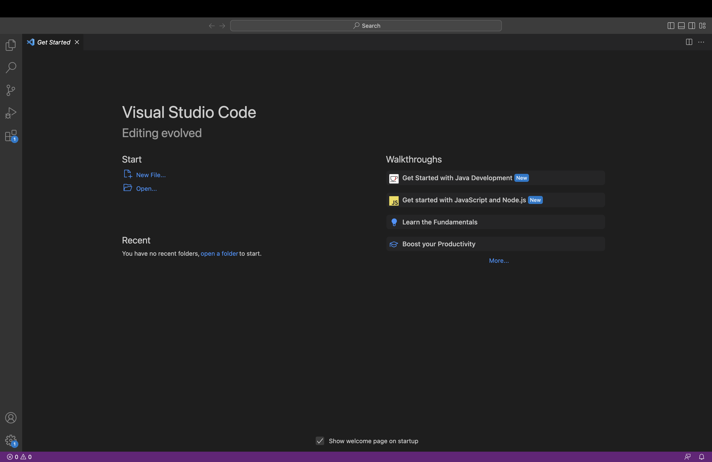
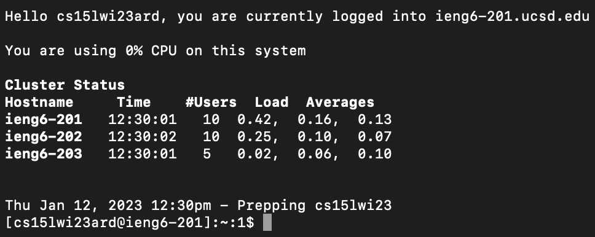
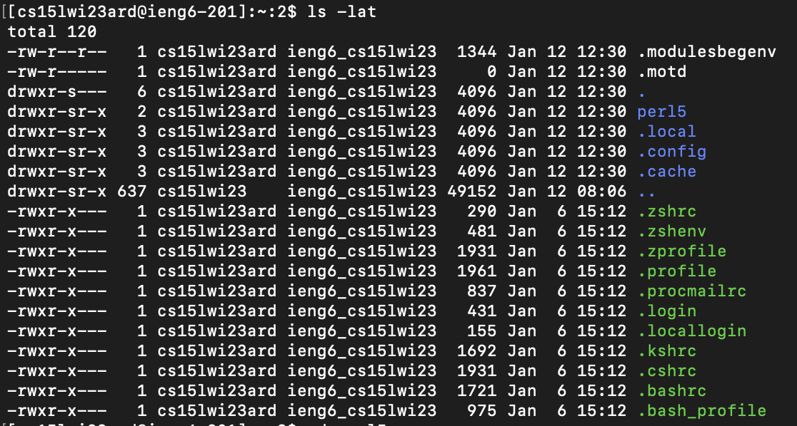
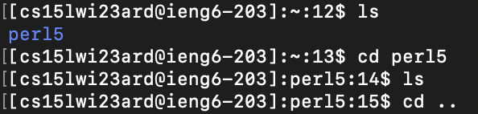
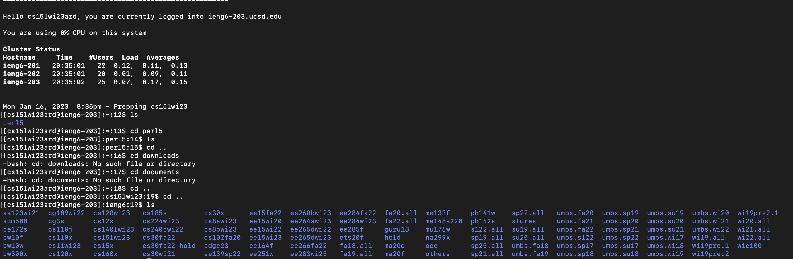

# Lab Report 1: CSE15L Setting up 

1. **Installing Visual Studio Code**:

Visit the following link to download the VS code installer:

https://code.visualstudio.com/download

After you've successfully installed VS code and opened it you should see something like this (this may differ based on the operating system you use):

2. **Login to remote machine using SSH**:

Type this command into the terminal: 
> `ssh cs15lwi23ard@ieng6.ucsd.edu` (Replacing "ard" with account-specific letters)

You will then be prompted to enter the password for your account. After entering the password correctly, you should see the following message:

3. **Trying out commands**:

You can then try running some commands remotely on the virtual machine, as shown in the examples below:

