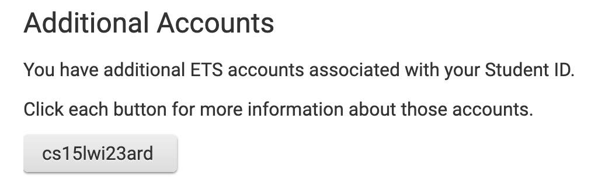
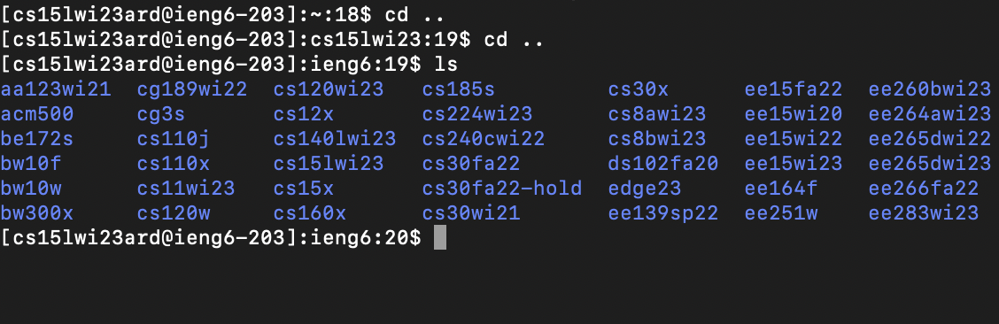

# Lab Report 1: CSE15L Setting up 

## 1. **Installing Visual Studio Code**: ##

Visit the following link to download the VS code installer:

[Download link](https://code.visualstudio.com/download)

After you've successfully installed VS code and opened it you should see something like this (this may differ based on the operating system you use):

## 2. **Login to remote machine using SSH**: ##

First, open command line interface or interpreter on your computer (The default applications for this are *Command Prompt* on Windows, and *Terminal* on Mac)
**_NOTE:_** The commands shown in this example were run on a Mac, using the *Terminal* application

Now, you'll need to set up your CSE15L account 

You can look up your account at the following link, using the username for your UCSD account and your PID:

[Account Lookup](https://sdacs.ucsd.edu/~icc/index.php)

You should see your account under the *Addditional Accounts* section, as shown below

You'll want to reset your password, which can be done through the Global Password Reset tool (Keep in mind, this will reset the password to all your UCSD accounts):

[Global Password Reset](https://sdacs.ucsd.edu/~icc/password.php)

After you've reset your password, you'll want to wait a while for the changes to take effect.

---

Next, Type this command into the terminal: 
> `ssh cs15lwi23ard@ieng6.ucsd.edu` (Replacing "ard" with account-specific letters)

You will then be prompted to enter the password for your account. After entering the new password correctly, you should see the following message:

## 3. **Trying out commands**: ##

You can then try running some commands remotely on the virtual machine, as shown in the examples below:

## 4. **Conclusion**: ##

That's it. You're done setting up and connecting remotely. Feel free to continue experimenting with commands to try.
