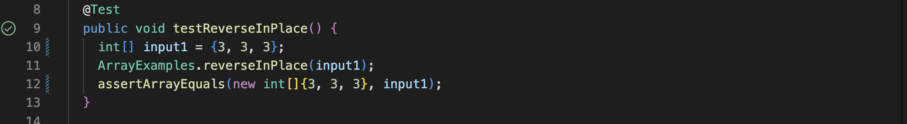

# Lab Report 2: 

## Part 1. **String Server**: ##

    import java.io.IOException;
    import java.net.URI;

    class Handler implements URLHandler {
        String outputString = "";
        String firstParameter;
        String secondParameter;
        public String handleRequest(URI url) {
            if (url.getPath().contains("/add-message")) {
                String[] URLparameters = url.getQuery().split("=");
                firstParameter = URLparameters[0];
                secondParameter = URLparameters[1];
                if (firstParameter.equals("s")) {
                    outputString = outputString + secondParameter + "\n";
                }
                return outputString;
            }
            return "invalid";
        }
    }

    class StringServer {
        public static void main(String[] args) throws IOException {
            if (args.length == 0) {
                System.out.println("Missing port number");
                return;
            }
            int port = Integer.parseInt(args[0]);

            Server.start(port, new Handler());
        }
    }
    
The methods called in the code are the *handleRequest* and *main* methods

The arguments to these methods are the *url*, which is of the URI type and *args*, which is of the String type.

## Part 2. **Lab 3 Bugs**: ##

     static void reverseInPlace(int[] arr) {
            for(int i = 1; i < arr.length; i += 1) {
              arr[i] = arr[arr.length - i];
            }
    }
---
This is the faulty code for the reverseInPlace method.

When the input `[3, 3, 3]` is used to test this method, it doesn't induce a failure, as shown below:

  	 @Test 
	public void testReverseInPlace() {
		int[] input1 = {3, 3, 3};
		ArrayExamples.reverseInPlace(input1);
		assertArrayEquals(new int[]{3, 3, 3}, input1);
	}

However, when another input like `[1, 2, 3, 4, 5, 6, 7, 8]` is used, for example, the test does not pass:
    
  	@Test 
        public void testReverseInPlace() {
            int[] input1 = {1, 2, 3, 4, 5, 6, 7, 8};
            ArrayExamples.reverseInPlace(input1);
            assertArrayEquals(new int[]{8, 7, 6, 5, 4, 3, 2, 1}, input1);
        }

