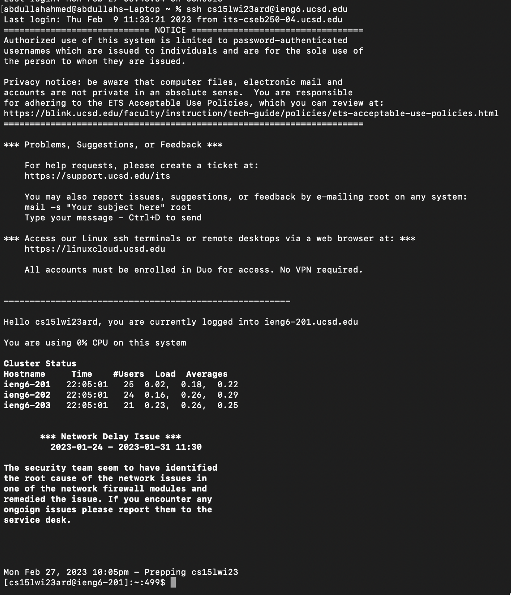
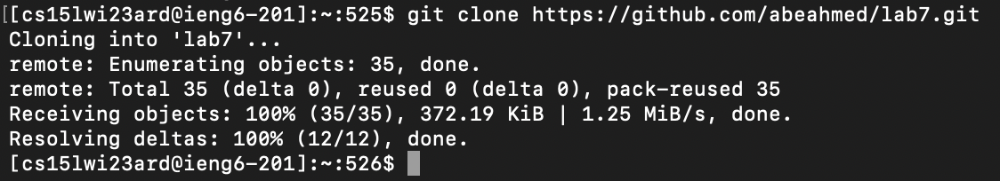
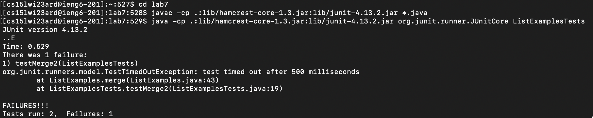
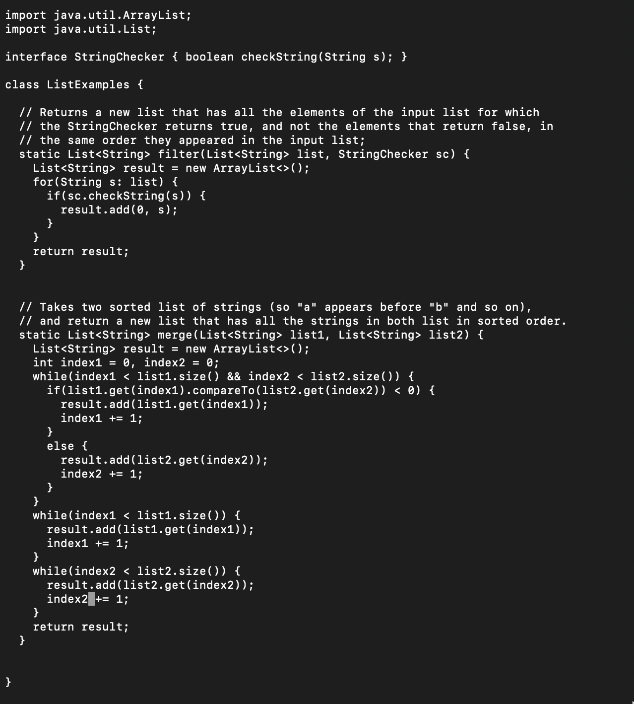
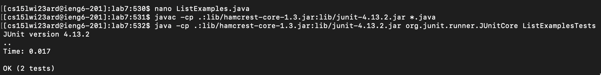
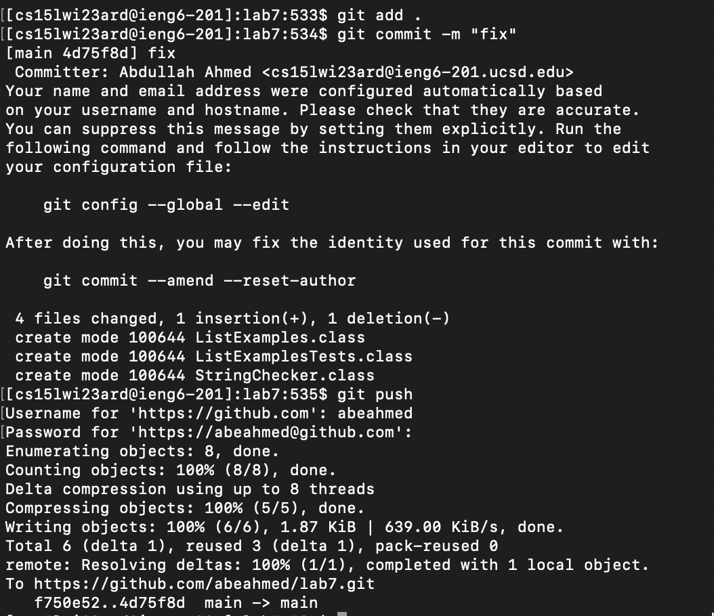

# Lab Report 4: 

## Step 4: ##

- ssh `<cmd-v><enter>` (paste cs15lwi23ard@ieng6.ucsd.edu)

## Step 5: ##

- git clone `<cmd-v><enter>` (paste https://github.com/abeahmed/lab7.git)

  
## Step 6: ##

- cd lab7 `<enter>`

- `<up><up><up><up><up><up><up><up><up><up><up><up><up><up><up><up><enter>`
  
javac -cp .:lib/hamcrest-core-1.3.jar:lib/junit-4.13.2.jar *.java
  
- `<up><up><up><up><up><up><up><up><up><up><up><up><up><up><up><up><enter>`
  
java -cp .:lib/hamcrest-core-1.3.jar:lib/junit-4.13.2.jar org.junit.runner.JUnitCore ListExamplesTests

  
## Step 7: ##
  
- nano Li `<tab>` .j `<tab><enter>`
  
- `<control><shift><->` 43 `<right><right><right><right><right><right><right><right><right><right><right><right><backspace>` 2
 
- `<control>` o `<enter>`

- `<control>` x `<enter>`

  
## Step 8: ##
  
- `<up><up><up><up><enter>`
  
javac -cp .:lib/hamcrest-core-1.3.jar:lib/junit-4.13.2.jar *.java
  
- `<up><up><up><up><enter>`
  
java -cp .:lib/hamcrest-core-1.3.jar:lib/junit-4.13.2.jar org.junit.runner.JUnitCore ListExamplesTests

## Step 9: ##
  
- git add . `<enter>`
- git commit -m "fix" `<enter>`
- git push `<enter>`
- __*github username*__ `<enter>`
- __*github authentication token*__ `<enter>`

  

          
          
          

          
          
          
          

          
          
          
          

          
          
          
          
